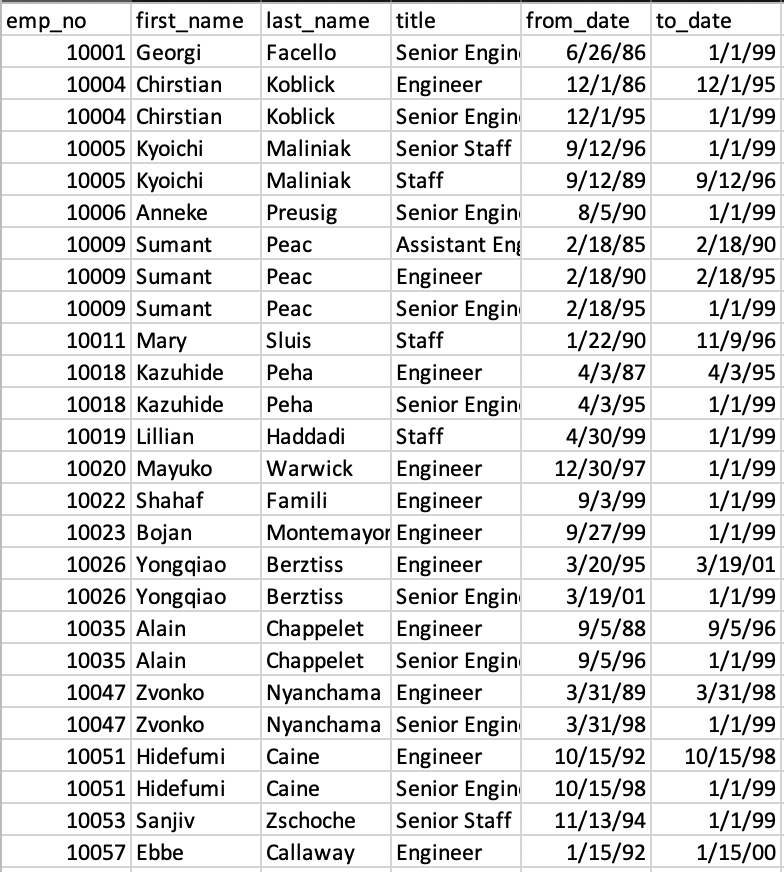
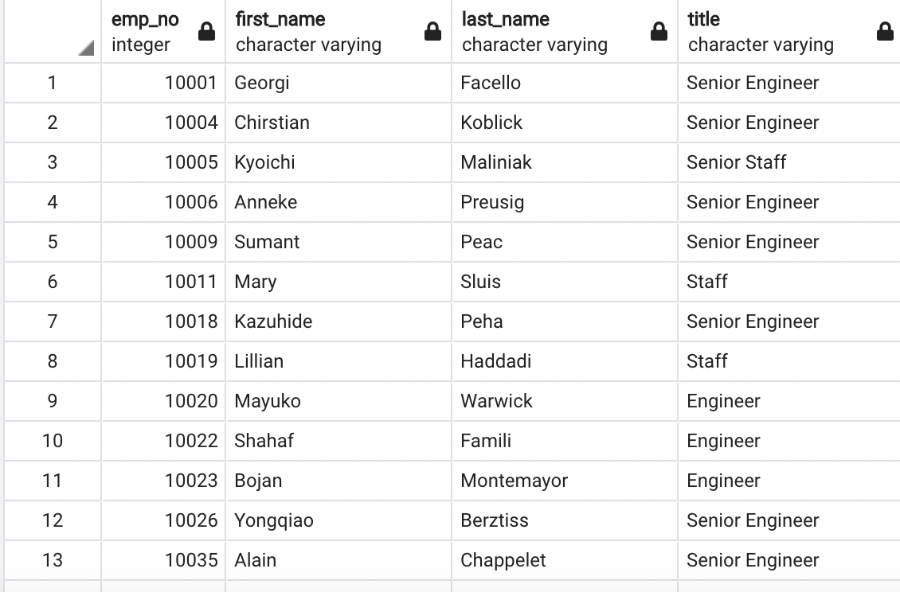
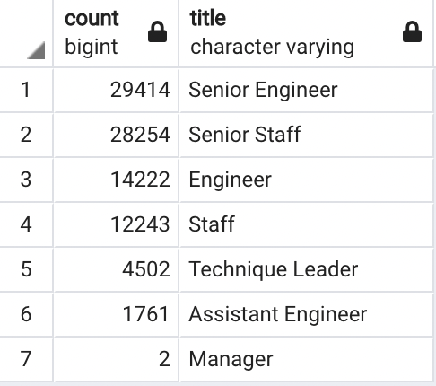
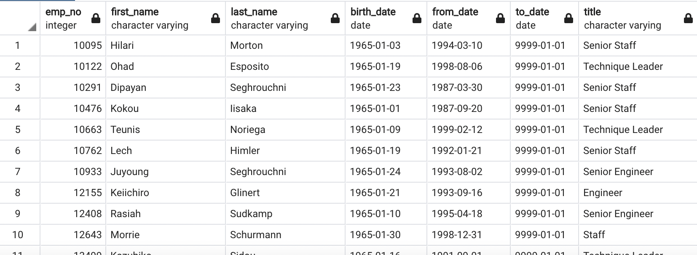

# Pewlett-Hackard-Analysisy

## Overview 
This analysis was performed to identify employees at Pewlett Hackard that are eligible for 1) retirement in the near future and 2) company mentorship program. 
## Results: 
Below are four results gained from this analysis: 
- Many employees have enjoyed a longstanding career within the company. After filtering to employees born from 1952-1955, it can be seen that many have duplicate title records from occupying various roles either by promotion or making career changes. 

- Since the client is interested in knowing what current roles they are likely to need to refill in the near future, we can filter to the most recent title for each of these employees if we order the employee records by their "To Date" in descending order and then use the "Distinct On" function to pull only one record. nu

- Then the aggregate numbers for each role were calculated for employees becoming eligible for retirement, with Senior Engineer and Senior Staff respectively making the most impacted roles. 

- When looking at current employees that were born in 1965, we see that there are about 1500 employees that are currently eligible for the mentorship program. See examples below: 

## Summary

It looks like a high number of employees are nearing retirement eligibility, but there are a few things to consider before determining if this is something to worry about. If we sum the count of employees in the retiring_titles table, we see that about 90,000 roles are likely to need to be filled in the next few years. The current mentorship program only looks at employees born in 1965, but if expanding the selection, it could be possible to prepare the necessary backfills for these upcoming vacancies. I would recommend a table that looks at employees born in 1965-1970 to see if this numnber meets the needs of filling the roles we've analyzed in this project. I would also recommmend a table that looks at the number of current employees in lower level positions grouped by age to view the overall talent funnel within the company. 
